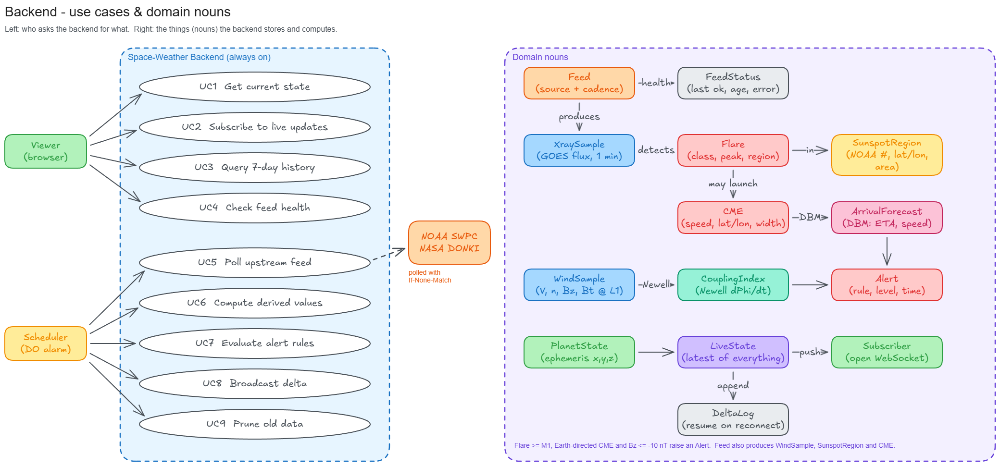
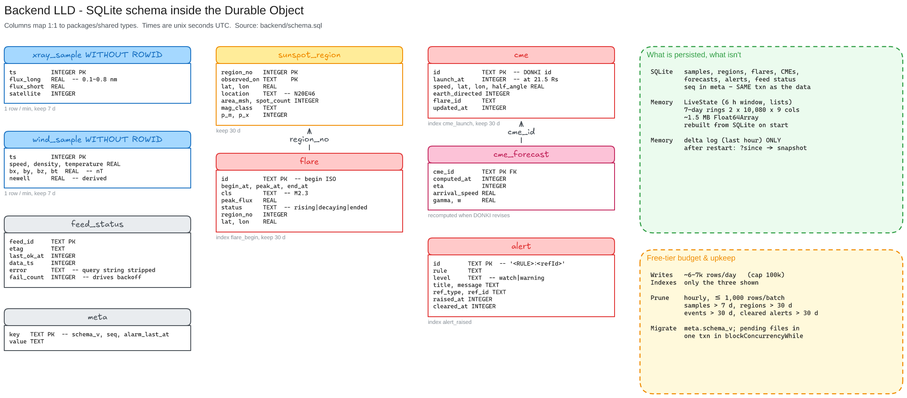
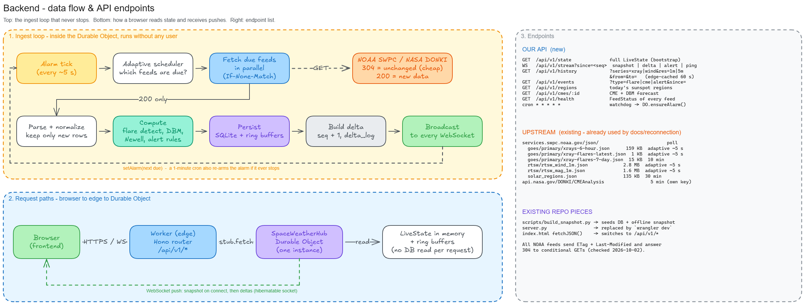
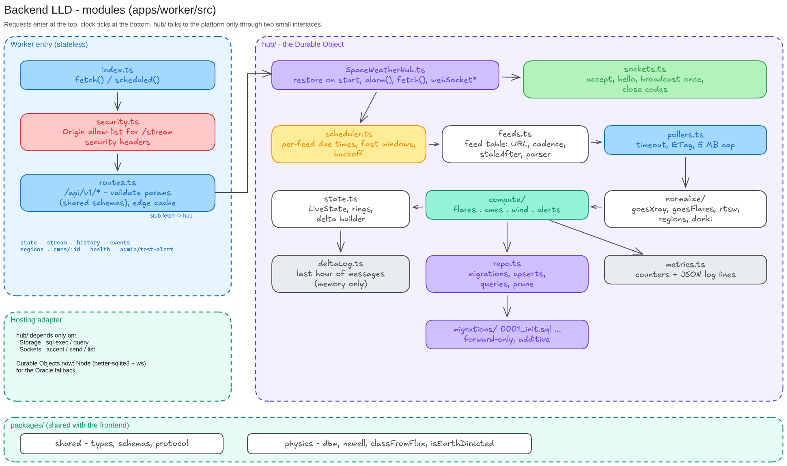

# Backend Design

> Detailed design (as built and planned): [DETAILED_DESIGN.md](DETAILED_DESIGN.md).

Cloudflare Worker + one Durable Object (`SpaceWeatherHub`) that **polls, computes, stores and pushes** without stopping. Stack and hosting details are in [../TECH_STACK.md](../TECH_STACK.md).

Diagrams are built in Excalidraw. The editable sources are in [diagrams/src/](diagrams/src/), and the generator is [../_tools/backend_diagrams.py](../_tools/backend_diagrams.py).

## 1. Use cases & nouns



| Actor | Use cases |
|---|---|
| Viewer (browser) | UC1 get current state · UC2 subscribe to live updates · UC3 query 7-day history · UC4 check feed health |
| Scheduler (DO alarm) | UC5 poll feeds · UC6 compute DBM / Newell / flare detection · UC7 evaluate alert rules · UC8 broadcast delta · UC9 prune old data |

| Noun | Meaning |
|---|---|
| Feed / FeedStatus | One upstream URL and its cadence, stale threshold / last success, data age, error |
| XraySample, WindSample | 1-minute GOES and L1 measurements |
| Flare, SunspotRegion | Detected flare and the region it came from |
| CME, ArrivalForecast | DONKI CME and our drag-based model (DBM) ETA at Earth |
| CouplingIndex | Newell coupling computed from the solar wind |
| Alert | A fired rule: flare ≥ M1, Earth-directed CME, Bz ≤ −10 nT |
| LiveState | The latest value of everything, kept in memory |
| DeltaLog | Last hour of deltas, so a reconnecting client can catch up |

## 2. Database schema



Full DDL: [schema.sql](schema.sql). Retention: samples 7 days, events 30 days. The 1-hour delta log lives in memory only (not a table).

## 3. Data flow & endpoints



### Our API (new)

| Method | Path | Returns | Served from |
|---|---|---|---|
| GET | `/api/v1/state` | Full `LiveState` (bootstrap) | memory |
| WS | `/api/v1/stream?since=<seq>` | `snapshot`, then `delta` / `alert` / `ping` | memory + delta ring |
| GET | `/api/v1/history?series=xray\|wind&res=1m\|5m&from&to` | Columnar arrays | memory, edge-cached 60 s |
| GET | `/api/v1/events?type=flare\|cme\|alert&since=` | Event list | SQLite (small) |
| GET | `/api/v1/regions` | Today's sunspot regions | memory |
| GET | `/api/v1/cmes/:id` | CME + DBM forecast | memory |
| GET | `/api/v1/health` | `FeedStatus` for each feed | memory |

**WS message shape:** `{ "type": "delta", "seq": 1042, "ts": 1790930000, "data": { "xray": [...], "alerts": [...] } }`. If a client sees a gap in `seq`, it asks for a fresh snapshot.

### Upstream (existing feeds, already used by [docs/reconnection](../../reconnection/index.html))

| Feed | Poll |
|---|---|
| `services.swpc.noaa.gov/json/goes/primary/xrays-6-hour.json` | adaptive ~5 s |
| `.../goes/primary/xray-flares-latest.json` | adaptive ~5 s |
| `.../goes/primary/xray-flares-7-day.json` | 10 min |
| `.../rtsw/rtsw_wind_1m.json`, `rtsw_mag_1m.json` | adaptive ~5 s |
| `.../solar_regions.json` | 30 min |
| `api.nasa.gov/DONKI/CMEAnalysis` | 5 min. Needs a free personal key; `DEMO_KEY` is too limited. |

Every poll sends `If-None-Match`. A `304` costs almost nothing.

### Existing repo pieces

| File | Becomes |
|---|---|
| `docs/reconnection/scripts/build_snapshot.py` | Seeds the DB on first deploy and still builds the offline `snapshot.js` |
| `server.py` | Replaced by `wrangler dev` |
| `docs/reconnection/index.html` `fetchJSON()` | Points at `/api/v1/*` instead of NOAA directly |

## 4. Components & router



```
apps/worker/src/
  index.ts            fetch() + scheduled() entry, Hono app
  routes/             state, stream, history, events, regions, cmes, health
  hub/
    SpaceWeatherHub.ts   Durable Object: alarm(), fetch(), webSocketMessage()
    scheduler.ts         adaptive due-times per feed
    pollers/             goes, flares, rtsw, regions, donki
    normalize/           NOAA/NASA JSON -> rows
    compute/             flareDetect, alerts (uses packages/physics)
    memory.ts            LiveState + ring buffers
    repo.ts              SQLite access
    sockets.ts           accept, hibernate, broadcast
packages/
  shared/   types.ts       LiveState, Delta, Alert ...
  physics/  dbm.ts, newell.ts, flareClass.ts
  protocol/ messages.ts    zod schema for WS messages
```
