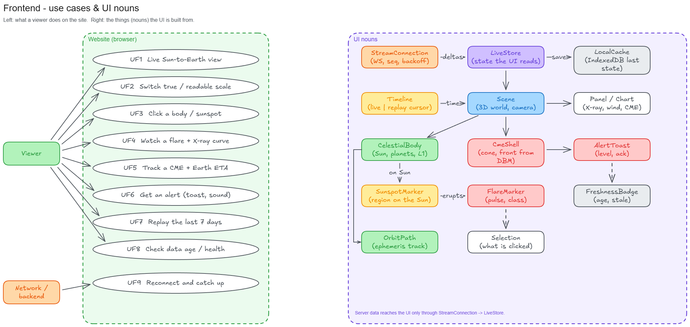
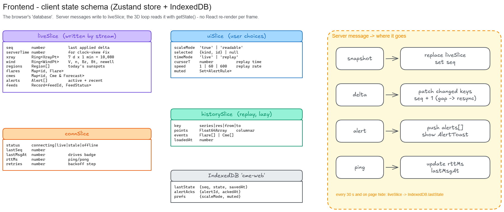
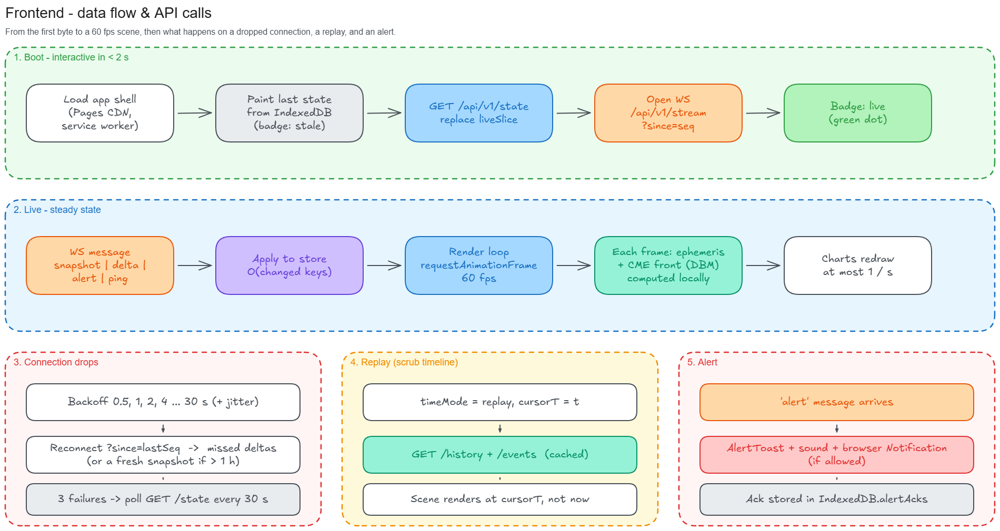
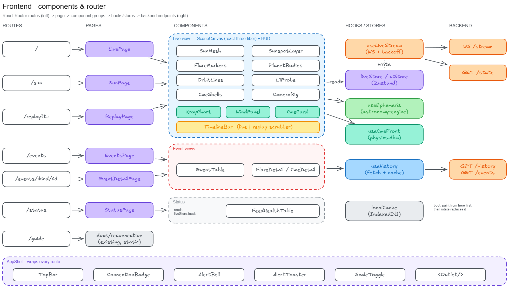

# Frontend Design

A Vite + React single-page app with a three.js scene. It is hosted on Cloudflare Pages and fed by one WebSocket. Stack details are in [../TECH_STACK.md](../TECH_STACK.md).

Diagrams are built in Excalidraw. The editable sources are in [diagrams/src/](diagrams/src/), and the generator is [../_tools/frontend_diagrams.py](../_tools/frontend_diagrams.py).

## 1. Use cases & UI nouns



| ID | Use case | Done when |
|---|---|---|
| UF1 | See the live Sun → Earth view | Planets at their real positions; Sun with today's sunspots |
| UF2 | Switch true / readable scale | One toggle, animated camera |
| UF3 | Click a body or sunspot | Side card with its data |
| UF4 | Watch a flare | Marker pulses on its region; X-ray curve updates live |
| UF5 | Track a CME | Cone moves out from the Sun (DBM); Earth ETA shown |
| UF6 | Get an alert | Toast + sound + browser notification if allowed |
| UF7 | Replay 7 days | Drag the timeline; the scene shows that moment |
| UF8 | Check freshness | Age shown next to every value; turns amber when stale |
| UF9 | Reconnect | Catches up on missed deltas without reloading |

## 2. Client state schema



- **liveSlice** is written only by the stream. **uiSlice** is written only by user input.
- The 3D loop reads with `useStore.getState()` inside `useFrame`, **not** through React hooks, so a delta never triggers a 60 fps re-render.
- Time series are ring buffers backed by `Float64Array` (10,080 points = 7 days at 1 minute).

## 3. Data flow & API calls



| When | Call |
|---|---|
| Boot | IndexedDB `lastState` → `GET /api/v1/state` → `WS /api/v1/stream?since=seq` |
| Live | WS messages only. No polling. |
| Replay / event pages | `GET /api/v1/history`, `GET /api/v1/events`, `GET /api/v1/cmes/:id` |
| WS down 3× | `GET /api/v1/state` every 30 s until the socket comes back |

**No-lag rules**

1. Never wait on the network to draw. Paint from the cache first, then update.
2. Planet and CME positions are computed in the browser every frame (astronomy-engine + `physics.dbm`). The server only sends inputs.
3. Charts redraw at most once per second. The 3D scene runs at 60 fps on its own.
4. Heavy parsing (history arrays) runs in a Web Worker.

## 4. Components & router



| Route | Page | Main components |
|---|---|---|
| `/` | LivePage | SceneCanvas (SunMesh, SunspotLayer, FlareMarkers, PlanetBodies, OrbitLines, L1Probe, CmeShells, CameraRig) + HUD (XrayChart, WindPanel, CmeCard) + TimelineBar |
| `/sun` | SunPage | SceneCanvas focused on the Sun + region list |
| `/replay?t=` | ReplayPage | SceneCanvas + TimelineBar in replay mode |
| `/events` | EventsPage | EventTable (flares, CMEs, alerts) |
| `/events/:kind/:id` | EventDetailPage | FlareDetail / CmeDetail (DBM chart) |
| `/status` | StatusPage | FeedHealthTable |
| `/guide` | static | the existing [reconnection guide](../../reconnection/index.html) |

AppShell wraps every route: TopBar, ConnectionBadge, AlertBell, AlertToaster, ScaleToggle.

```
apps/web/src/
  main.tsx, router.tsx
  shell/       AppShell, TopBar, ConnectionBadge, AlertToaster
  pages/       Live, Sun, Replay, Events, EventDetail, Status
  scene/       SceneCanvas, SunMesh, SunspotLayer, FlareMarkers, PlanetBodies, CmeShells, CameraRig
  hud/         XrayChart, WindPanel, CmeCard, TimelineBar
  stream/      useLiveStream.ts (WS, backoff, seq check)
  store/       live.ts, ui.ts, history.ts
  lib/         ephemeris.ts, cmeFront.ts, localCache.ts
```
